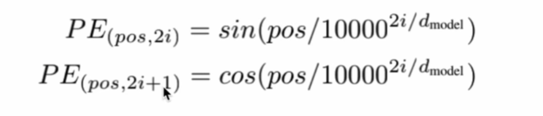
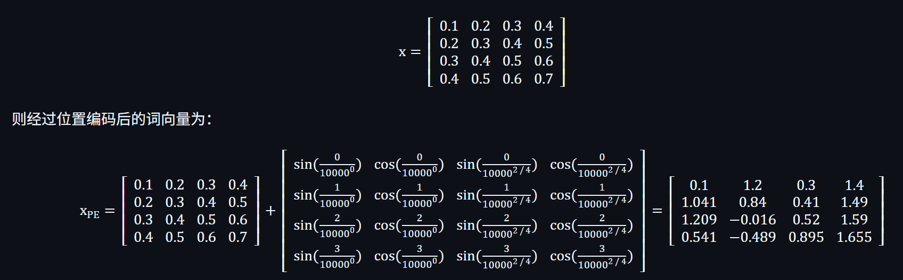
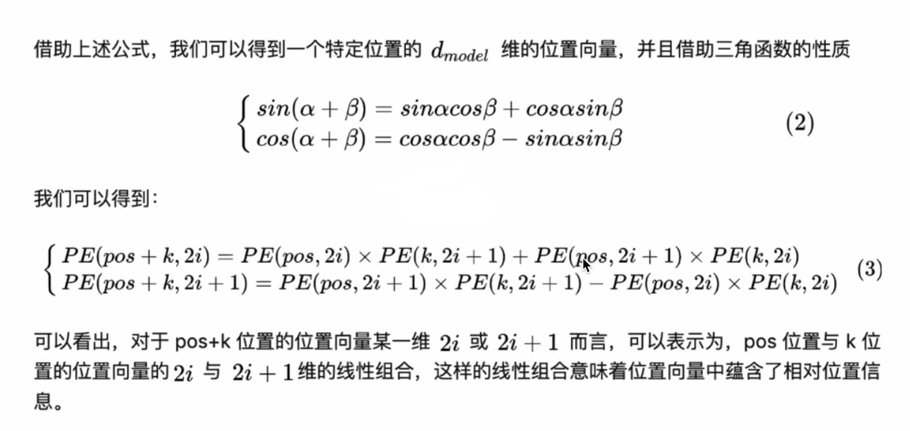

# 位置编码 Positional Encoding
位置编码是为了解决注意力机制的一个问题，因为注意力机制是并行计算，导致了每个词与其他词之间的权重是不包含位置信息的，即无论这个词在哪里，它计算得到的与其他词的权重都是一样的。我爱打魔兽世界和魔兽世界爱打我，"我"这个词与"爱"、"打"、"魔兽世界"之间的权重完全相同。所以我们需要给词与词之间加入位置信息。

## 公式

pos表示词在句子中的位置，0、1、2、3...这种  
i表示当前计算到的词向量的维度的索引
$PE_(pos,2i)$和$PE_(pos,2i+1)$中的2i和2i+1就是表示偶数索引维度和奇数索引维度  

举个例子，我 爱 打 魔兽世界，四个词的词向量组成的矩阵，每一行就是一个词的词向量

## 意图
为什么要这么设计呢，可以看一个公式  

假如 pos+k=4，我求出了4这个位置的词的位置编码，然后通过这个公式可以看出，4这个词的位置编码同时可以用位置1和位置3的词的位置编码求出，或者位置2和位置2的位置编码求出，即位置4的位置编码同样包含了位置1,2,3的信息，即包含了相对位置信息，因为我可以用位置1,2,3求出位置4，他们之间肯定是有关系的。